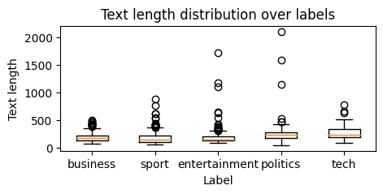
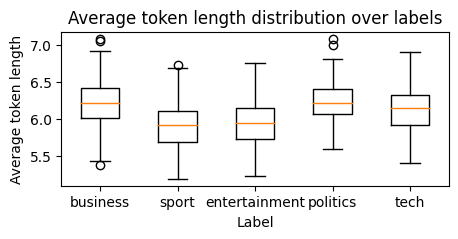
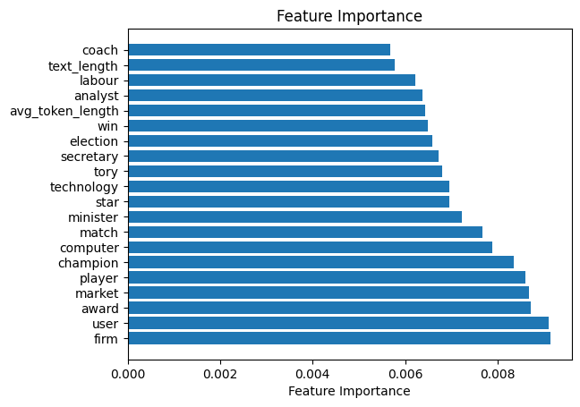

# Part 2 Report

In the part 2 of the coursework, we will be using the BBC text dataset to train a classification model on the news articles.

## 1. Data loading and preprocessing

The first step is to load the dataset and process it into a format that can be used by the model. Each text is put into the data frame as a row, and the category of the news is put into the data frame as a column. For text preprocessings, the following steps are taken:

1. Text tokenization. This is done using the `nltk` library, and the text is split into words and punctuation marks. This step ensures that the text is split into meaningful tokens that can be used by the model.

2. Text normalization. All words are converted to lowercase to ensure that the model does not treat words with different cases as different words.

3. Filter non-alphabetic words. All words that contain non-alphabetic characters are removed from the text. The numbers, symbols, and punctuation marks can generally not be processed in the same way as words, doing so will lead to a large number of unique tokens that are not very informative.

4. Filter short words. Considering that short words are not very informative, all words with less than 3 characters are removed from the text.

5. Stop words removal. Stop words are words that are very common in the language and do not carry much information that may contribute to the classification. These words are removed from the text.

6. Lemmatization. Lemmatization is the process of converting words to their base form. This is done to ensure that words in different forms are treated as the same word by the model.

## 2. Feature extraction

### 2.1. Text vectorization

Before performing feature extraction, the data set is randomly split into a training set and a test set in a 80:20 ratio. Additionally, the split is stratified by the label to ensure that the distribution of the labels in the training set and the test set is similar, which is important to ensure that the model is trained and tested without bias towards any label. It is important to note that the label distribution is approximately balanced, the most common label is sport with 511 samples, and the least common label is entertainment with 386 samples, in which the class imbalance is generally acceptable.

The next step is to extract features from the text data. The common way is to build vocabulary and represent each text as a vector of word counts. Therefore, the vocabulary is built from the training set. Besides simple unigram (single word) counts, bigram (two consecutive words) is also considered to capture the context of the words, since there are many phrases that are more informative than individual word. Subsequently, words that appear in less than 5 documents or more than 50% of the documents are removed from the vocabulary, this is to remove words that are too rare or too common to be informative, and is a common practice to significantly reduce the size of the vocabulary. The final vocabulary contains 13497 words. Eventually, the text data is represented as a vector of length 13497, where each element is the count of the corresponding word in the text. The steps are summarized as follow:

1. Build vocabulary from the training set, using unigram and bigram.

2. Remove words that appear in less than 5 documents or more than 50% of the documents.

3. Represent each text as a vector of word counts.

### 2.2 Other features

To align with the requirement of the coursework, two additional features are extracted from the text data. The first feature is the word count of the text. From Figure 1, we can observe that the median value of text lengths between different categories shows a difference, which suggests that the word count can be a significant indicator for the classification.

    
    
Figure 1: Boxplot of word count by category

On the other hand, the average token length of the text is also considered as a feature. This comes from the intuition that the terms in some categories may be generally longer than others. The boxplot in Figure 2 shows that the average token length of the text varies between different categories, which suggests that the average token length can also serve as a feature for the classification.

    
    
Figure 2: Boxplot of average token length by category

## 3. Model

After gathering all the features into a single feature matrix, the random forest model is employed to be the model used for classification. In order to optimize the performance of the model, the hyperparameters are tuned under a 5-fold cross-validation. For simplicity, the `GridSearchCV` module from the `sklearn` library is used to perform the hyperparameter tuning. This module exhaustively searches for the best hyperparameters from the given hyperparameter grid, and the documentation can be found [here](https://scikit-learn.org/stable/modules/generated/sklearn.model_selection.GridSearchCV.html). According to the nature of our data, the following hyperparameters are considered and possibly tuned:

1. `n_estimators`: The number of trees in the forest - this is the most important parameter to be tuned. The default value is 100, some simple experiments show that the performance of the model can be improved by adding more trees. Therefore, the hyperparameter grid is set to be `[10, 50, 100, 200, 300, 400, 500]`.

2. `min_samples_leaf`: This controls the minimum number of samples required to be at a leaf node. This parameter efficiently controls the complexity of the model. Considering our dataset contains only 1k+ samples, the default value of 1 is appropriate, since we may need a complex model to capture more precise patterns. However, the hyperparameter grid is set to be `[1, 2, 4, 8, 16]` for the purpose of tuning.

3. `max_depth`: This controls the maximum depth of the tree. The default value is `None`, which means the nodes are expanded until all leaves are pure or until all leaves contain less than `min_samples_split` samples. However, considering our dataset contains 13k+ features, it is hard to set a proper range for this hyperparameter, since we don't know how many features are informative. Therefore, this hyperparameter is not tuned.

4. `min_samples_split`: This controls the minimum number of samples required to split an internal node. This works similarly to `min_samples_leaf`, therefore this hyperparameter is not tuned.

## 4. Results

### 4.1. Model performance

The final model achieved an accuracy of 96.85% on the testing set, the classification report is shown in the table below.

|               |   precision |   recall |   f1-score |    support |
|:--------------|------------:|---------:|-----------:|-----------:|
| business      |    0.952381 | 0.980392 |   0.966184 | 102        |
| entertainment |    1        | 0.961039 |   0.980132 |  77        |
| politics      |    0.9625   | 0.916667 |   0.939024 |  84        |
| sport         |    0.980769 | 1        |   0.990291 | 102        |
| tech          |    0.95122  | 0.975    |   0.962963 |  80        |
| accuracy      |    0.968539 | 0.968539 |   0.968539 |   0.968539 |
| macro avg     |    0.969374 | 0.96662  |   0.967719 | 445        |
| weighted avg  |    0.968829 | 0.968539 |   0.968417 | 445        |

The performance of the model on different categories is generally balanced, with no category having a significantly lower precision, recall, or f1-score. This ensures that the model is not biased towards any category, and is able to classify news articles from different categories with similar accuracy.

### 4.2. Feature importance

Figure 3 shows the top 20 important features of the model. We can see that term "firm", "user", "award", "market", and the rest of the terms are indeed informative for the classification, as they can only be found in certain types of news articles. In addition, the word count and the average token length are also listed in the top 20 important features, which suggests that the selection of these features are reasonable and successful.

    
    
Figure 3: Top 20 important features

## 5. Conclusion

This report demonstrates the process of training a text classification model that can be applied to the BBC text dataset. The final accuracy of the model is 96.85%, which can indeed be considered as a good performance. In fact, this result is predictable, since the provided categories - business, entertainment, politics, sport, tech - will intuitively have a significant difference in the terms used in the news articles. To further improve the performance, I believe that a broader categories and data sources can be considered, and the feature extraction can be extended using more advanced techniques, such as word embeddings and deep-learning-based models.